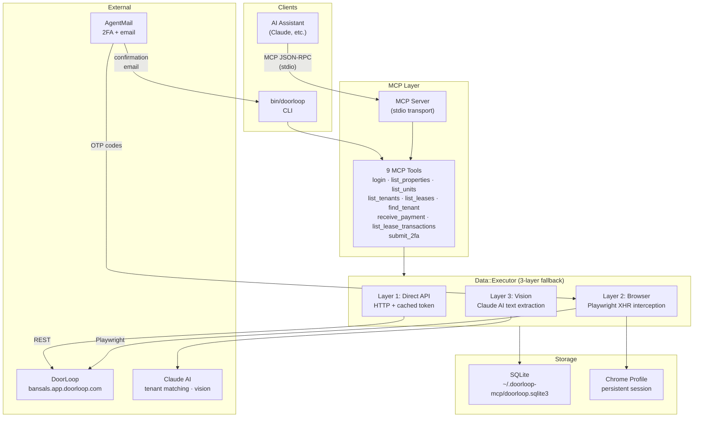
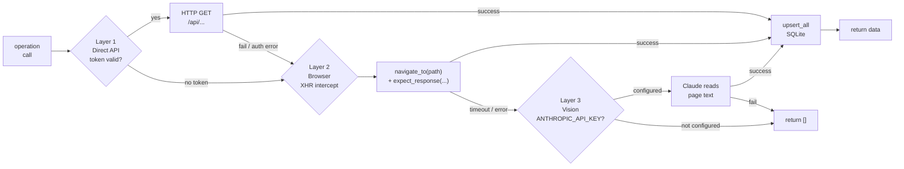
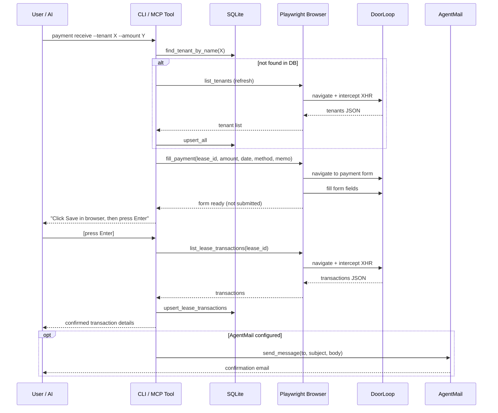

# doorloop-app

An MCP (Model Context Protocol) server for [DoorLoop](https://www.doorloop.com/) property management. Allows AI assistants (Claude, etc.) to interact with DoorLoop via browser automation and direct API calls.

## Features

### MCP Tools

| Tool | Description |
|------|-------------|
| `doorloop_login` | Authenticate with DoorLoop. Returns 2FA status if required. |
| `doorloop_submit_2fa` | Submit a 2FA verification code. |
| `doorloop_list_properties` | List all properties with address, type, and unit count. |
| `doorloop_list_units` | List units for a property with status and rent. |
| `doorloop_list_tenants` | List all tenants with contact info, lease, and balance. |
| `doorloop_find_tenant` | Search for a tenant by name or email. Falls back to AI fuzzy matching. |
| `doorloop_list_leases` | List leases, optionally filtered by property or status. |
| `doorloop_receive_payment` | Fill a payment form for a tenant (does **not** submit — user reviews and clicks Save). |
| `doorloop_list_lease_transactions` | List all transactions for a specific lease (requires `lease_id`). |

### Data Retrieval Strategy

Each read operation uses a 3-layer fallback:

1. **Direct API** — Fastest. Uses a token cached from a previous browser session.
2. **Browser (Playwright)** — Intercepts the DoorLoop XHR API response during page navigation.
3. **AI Vision (Claude)** — Extracts structured data from page text as a last resort.

All fetched data is cached in a local SQLite database (`~/.doorloop-mcp/doorloop.sqlite3`).

## Requirements

- Ruby 3.4+
- Node.js (for Playwright browser binaries)
- A DoorLoop account

## Setup

```bash
# Install dependencies
bundle install
npx playwright install chromium

# Configure environment
cp .env.example .env.local
# Edit .env.local with your DoorLoop credentials
```

### Environment Variables

```bash
DOORLOOP_EMAIL=you@example.com
DOORLOOP_PASSWORD=yourpassword
DOORLOOP_URL=yourorg.app.doorloop.com   # defaults to bansals.app.doorloop.com

# Optional
DOORLOOP_HEADLESS=true                  # set false to see the browser

# AgentMail — automatic 2FA retrieval + payment confirmation emails
AGENTMAIL_API_KEY=...
AGENTMAIL_INBOX_ID=...
DOORLOOP_CONFIRMATION_EMAIL_TO=you@example.com  # enables post-payment email

# Claude AI — vision fallback + tenant fuzzy matching
ANTHROPIC_API_KEY=...
DOORLOOP_LLM_MODEL=claude-haiku-4-5-20251001    # model for tenant fuzzy matching
DOORLOOP_VISION_MODEL=claude-sonnet-4-20250514  # model for vision page extraction
```

## Docker

### Quick start

```bash
# Build the image
docker compose build

# Login once to persist the Chrome session
docker compose run --rm login

# Run as MCP server (used by Claude Desktop / MCP clients)
docker compose run --rm mcp
```

The image bundles Ruby 4.0, Node.js 22, Chromium, and all Playwright dependencies. Data (Chrome profile + SQLite DB) is persisted to `~/.doorloop-mcp` on the host via a volume mount.

### MCP client config (Docker)

```json
{
  "mcpServers": {
    "doorloop": {
      "command": "docker",
      "args": ["compose", "-f", "/path/to/doorloop-app/docker-compose.yml", "run", "--rm", "mcp"]
    }
  }
}
```

### Image details

| Stage | Base | Purpose |
|-------|------|---------|
| `base` | `ruby:4.0.1-slim-bookworm` | Ruby + Node.js 22 + build deps |
| `gems` | `base` | Bundle install (without development group) |
| `playwright` | `gems` | `npm ci` + `playwright install chromium --with-deps` |
| `app` | `playwright` | Full source + `/data` volume |

- `ENTRYPOINT`: `bundle exec bin/doorloop`
- `CMD`: `server`
- Chromium runs headless with `--no-sandbox --disable-setuid-sandbox` (required in containers)
- `/data` volume: Chrome profile at `/data/chrome-profile`, SQLite at `/data/doorloop.sqlite3`

---

## Usage

### As an MCP Server (for Claude Desktop / Claude Code)

```bash
bin/doorloop server
```

Add to your MCP config:
```json
{
  "mcpServers": {
    "doorloop": {
      "command": "/path/to/doorloop-app/bin/doorloop",
      "args": ["server"]
    }
  }
}
```

### CLI Commands

```bash
bin/doorloop version              # Print version
bin/doorloop server               # Start MCP stdio server
bin/doorloop login                # Interactive login
bin/doorloop console              # IRB/Pry console with DoorLoopApp loaded
bin/doorloop properties list      # List all properties
bin/doorloop units list           # List units
bin/doorloop tenants list         # List all tenants
bin/doorloop leases list          # List all leases
bin/doorloop leases transactions --tenant "Shital"        # Fetch transactions by tenant name
bin/doorloop leases transactions --lease-id abc123 --raw  # JSON output
bin/doorloop payment receive \
  --tenant "Prayag Bansal" \
  --amount 4500 \
  --date 2026-03-01 \
  --method EFT \
  --memo "March rent"             # Fill payment form (prompts to confirm after Save)
```

### Console Usage

```ruby
# Load and authenticate
session = DoorLoopApp.session
session.start
session.ensure_authenticated!

# Fetch and cache data
DoorLoopApp.executor.call(:list_properties)
DoorLoopApp.executor.call(:list_tenants)
DoorLoopApp.executor.call(:list_leases)

# Query cached data
store = DoorLoopApp.store
store.all_tenants
store.find_tenant_by_name("Prayag")
store.active_leases

# Fill a payment form (does not submit)
payment_page = DoorLoopApp::Browser::Pages::PaymentPage.new(session)
payment_page.fill_payment(
  tenant_name: "Prayag Bansal",
  amount: "1200",
  date: "2026-03-01",
  payment_method: "EFT",
  memo: "March rent"
)
```

## Architecture

### System Overview



### Data Retrieval Flow



### Payment Flow



### File Structure

```
bin/doorloop              CLI entry point (Thor)
lib/doorloop_app/
  server.rb               MCP server setup
  tool.rb                 Base tool class
  tools/                  9 MCP tools
  browser/                Playwright session + page objects
    pages/                PropertiesPage, UnitsPage, TenantsPage,
                          LeasesPage, LeaseTransactionsPage, PaymentPage
  api/                    REST API client (token-based, post-login)
    endpoints/            Properties, Units, Tenants, Leases
  models/                 Sequel ORM models (SQLite)
    json_backed.rb        Shared upsert/find/stale logic
                          Property, Unit, Lease, Tenant, LeaseTransaction
  data/executor.rb        3-layer fallback orchestrator
  llm/tenant_matcher.rb   Claude AI fuzzy tenant matching
  vision/client.rb        Claude AI page text extraction
  agent_mail/client.rb    AgentMail 2FA retrieval + email sending
  notifications/          PaymentConfirmation (via AgentMail)
  cli/                    Thor CLI commands + subcommands
```

## Tests

```bash
bundle exec rake test
```

Tests use Minitest + Mocha with mock browser sessions. No live DoorLoop connection required.

## License

MIT
